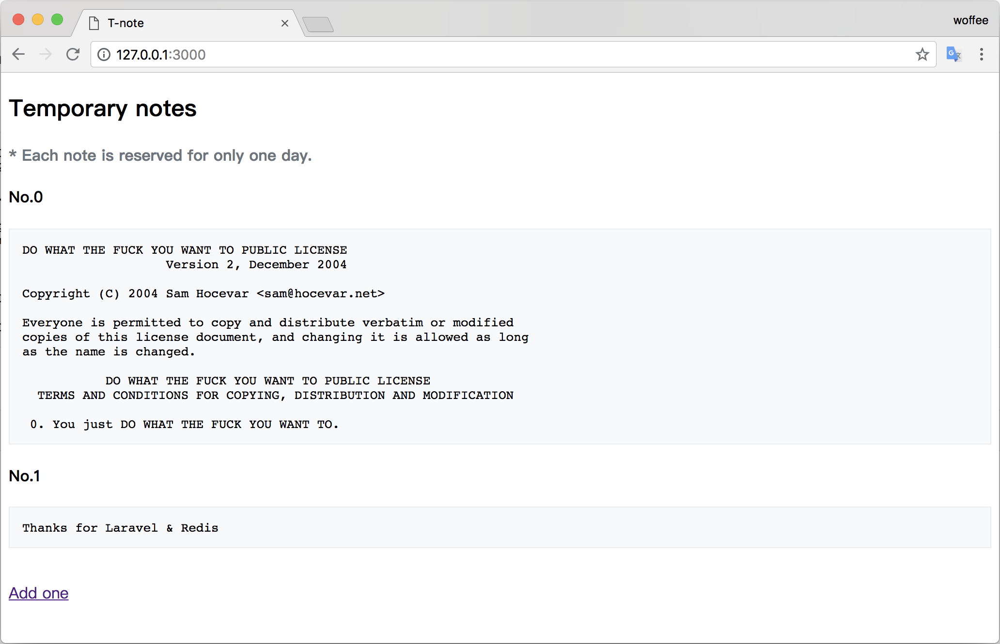

## About

Save some temporary notes, such as links. Automatically deleted after 24 hours.

## How to use

    pip install flask
    pip install waitress
    pip install werkzeug
    waitress-serve --port=3000 main:app

## License

            DO WHAT THE FUCK YOU WANT TO PUBLIC LICENSE
                    Version 2, December 2004

    Copyright (C) 2004 Sam Hocevar <sam@hocevar.net>

    Everyone is permitted to copy and distribute verbatim or modified
    copies of this license document, and changing it is allowed as long
    as the name is changed.

            DO WHAT THE FUCK YOU WANT TO PUBLIC LICENSE
    TERMS AND CONDITIONS FOR COPYING, DISTRIBUTION AND MODIFICATION

    0. You just DO WHAT THE FUCK YOU WANT TO.